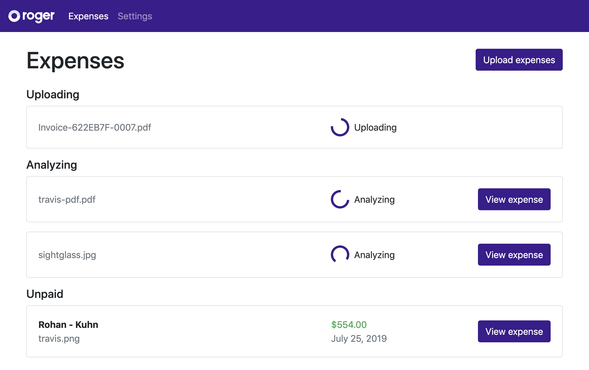
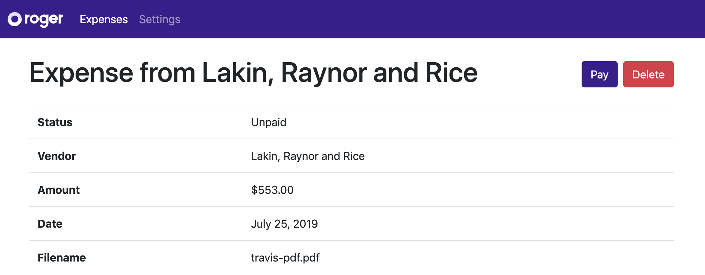

# Corpay One Web Take-home Test

Hi! We're super stoked that you're interested in working with us at Corpay One.

## Assignment

This repo is the beginning of a [create-react-app](https://facebook.github.io/create-react-app/) web app, which can upload and list expenses. Most of its functionality is missing. When you run `npm start` you'll see a simple UI with 2 menu items.

In `src/roger-api-client.ts`, there's a fake Corpay One API client, which you can use to build out the app.

Your assignment is to fork this repo to your personal GitHub account and implement the following features:

- On the Expenses page (`/expenses`), add a file input (or a button, which opens a file selector). When user selects one or more files, a expense should be created for each one (see the API client's `uploadExpense` method).
- The Expenses page should list all expenses with their time, filename, vendor name and amount. The list should be grouped by status: Uploading, Analyzing, Unpaid, Paid.
- The Expenses page should subscribe to expense updates from the API client (see the `on` method) and reflect changes live.
- Clicking a expense should take the user to a View-expense page (e.g. `/expenses/:id`). This page should display the expense's basic information.
- The View-expense page should have a button, "Pay", which should change the expense's status to Paid (call API client's `patchExpense` method and change its status).
- The View-expense page should have another button, "Delete", which should delete the expense. Bonus points if you ask the user to confirm first.

See examples of what the UI could look like further down.

When you're done, submit a PR (containing one or more commits) targeting this repo's master branch.

## Time limit

From the time you receive access to this repo, you have 3 hours to complete the assignment and submit your PR.

You do not have to use all 3 hours. We value quality over speed, so make sure to do a good job instead of rushing.

If you exceed the 3 hours, no worries, just submit what you have. But, please, submit something within the time limit.

If you encounter an unexpected interruption and must leave the assignment unfinished, please reach out to us, and we'll accommodate.

**Note:** At Corpay One, we don't have deadlines like this, which could potentially mean rushed launches with sub-optimal user experiences. This is an assignment, and we want to set clear a expectation of how much of your time we expect.

## Tips and pointers

- The app is currently using [Bootstrap](https://getbootstrap.com) for CSS. Feel free to remove or replace with your favorite CSS or component library. This is not a design test, but we value good UX, so make sure to make user interactions smooth.
- The app uses TypeScript. If you want to, you can write the rest of the code in plain JavaScript. Whatever you choose, it's not important.
- The fake Corpay One API client stores data in `localStorage`. You can reset it to start from scratch under Settings (`/settings`).
- You're free to use functional React components, hooks and/or class components. You're also free to add any state management tools (e.g. Redux) if you think it helps you. Use whatever you feel most comfortable with.
- Bonus points if you add tests for code you add. The `src/tests` folder already contains some tests of the existing code.
- We value clear, concise and well-formatted code. We use Prettier for all our own JavaScript, and you're welcome to format your app using Prettier. The repo is already configured for it.
- Make sure your resulting app does not have any ESLint or TypeScript errors.
- We promise to give you constructive feedback on your work.
- If anything is unclear, please reach out to us asap.

## Example UI

Here are some example wireframes of what your UI could look like. List of expenses:

Show expense:

---

The rest of this README is the standard create-react-app README content, which describes how to start and test the app.

## Available Scripts

In the project directory, you can run:

### `npm start`

Runs the app in the development mode. 
Open [http://localhost:3000](http://localhost:3000) to view it in the browser.

The page will reload if you make edits. 
You will also see any lint errors in the console.

### `npm test`

Launches the test runner in the interactive watch mode. 
See the section about [running tests](https://facebook.github.io/create-react-app/docs/running-tests) for more information.

### `npm run build`

Builds the app for production to the `build` folder. 
It correctly bundles React in production mode and optimizes the build for the best performance.

The build is minified and the filenames include the hashes. 
Your app is ready to be deployed!

See the section about [deployment](https://facebook.github.io/create-react-app/docs/deployment) for more information.

### `npm run eject`

**Note: this is a one-way operation. Once you `eject`, you can’t go back!**

If you aren’t satisfied with the build tool and configuration choices, you can `eject` at any time. This command will remove the single build dependency from your project.

Instead, it will copy all the configuration files and the transitive dependencies (Webpack, Babel, ESLint, etc) right into your project so you have full control over them. All of the commands except `eject` will still work, but they will point to the copied scripts so you can tweak them. At this point you’re on your own.

You don’t have to ever use `eject`. The curated feature set is suitable for small and middle deployments, and you shouldn’t feel obligated to use this feature. However we understand that this tool wouldn’t be useful if you couldn’t customize it when you are ready for it.

## Learn More

You can learn more in the [Create React App documentation](https://facebook.github.io/create-react-app/docs/getting-started).

To learn React, check out the [React documentation](https://reactjs.org/).

### Code Splitting

This section has moved here: https://facebook.github.io/create-react-app/docs/code-splitting

### Analyzing the Bundle Size

This section has moved here: https://facebook.github.io/create-react-app/docs/analyzing-the-bundle-size

### Making a Progressive Web App

This section has moved here: https://facebook.github.io/create-react-app/docs/making-a-progressive-web-app

### Advanced Configuration

This section has moved here: https://facebook.github.io/create-react-app/docs/advanced-configuration

### Deployment

This section has moved here: https://facebook.github.io/create-react-app/docs/deployment

### `npm run build` fails to minify

This section has moved here: https://facebook.github.io/create-react-app/docs/troubleshooting#npm-run-build-fails-to-minify
